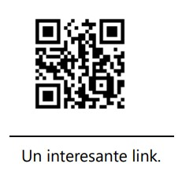
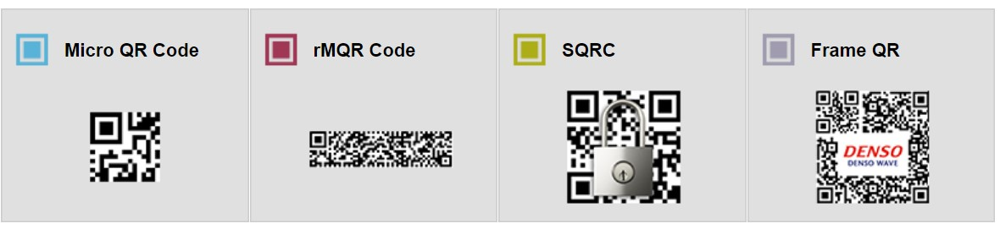
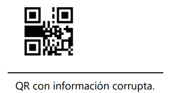
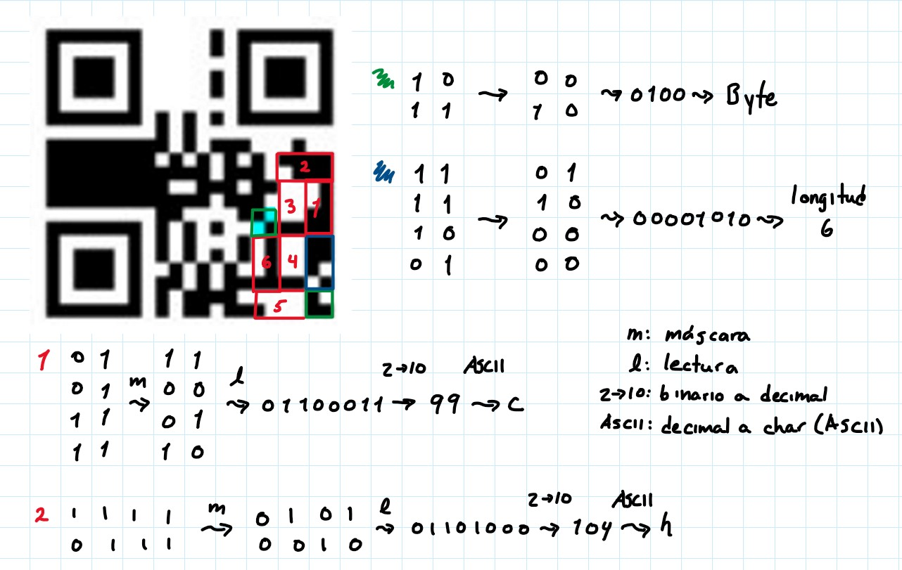
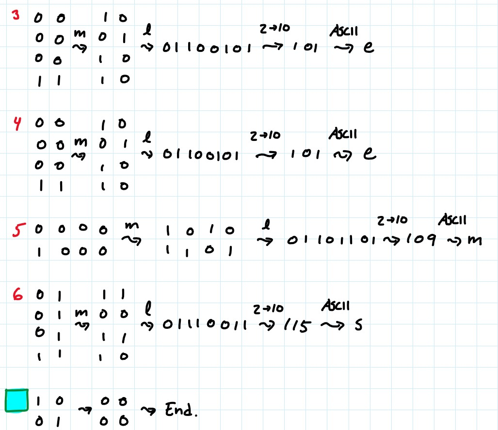

# Práctica 3: Códigos QR
## *Equipo: Avonlea*
### Integrante~~s~~: Sergio Medina Guzmán 314332428

## Para ejecutar los requisitos de la práctica

### Introducción:
INFORMACIÓN IMPORTANTE: Las clases Polinomio.java y ReedSolomonEC.java fueron proporcionadas en su totalidad
por el ayudante David Armando Silva de Paz de la clase Teoría de Códigos impartida por la profesora Anayanzi Delia Martínez Hernández.
Así mismo, el esqueleto de las clases QR.java y Main.java fueron también proporcionadas por David; dichos esqueletos
pueden consultarse en la carpeta orig de este repositorio. Lo demás ha sido programado por un servidor.

Los códigos QR, o códigos de respuesta rápida, son una forma de tecnología de código de barras bidimensional que se ha vuelto ampliamente popular en los últimos años. Fueron inventados por la compañía japonesa Denso Wave en 1994 y desde entonces han sido utilizados en una amplia variedad de aplicaciones.

Los códigos QR están compuestos por un patrón de cuadrados en blanco y negro dispuestos en una cuadrícula. Estos códigos pueden almacenar una gran cantidad de información, como texto, enlaces a sitios web, información de contacto, números de teléfono y mucho más. 

Una de las principales ventajas de los códigos QR es que se pueden escanear rápidamente utilizando la cámara de un teléfono inteligente o una tablet equipada con una aplicación de escaneo de códigos QR. Una vez escaneado, el código QR puede desencadenar una serie de acciones, como abrir un sitio web, mostrar información adicional o incluso realizar pagos.

Los códigos QR se utilizan en una amplia gama de industrias, incluyendo publicidad, marketing, transporte, comercio electrónico y logística. Su popularidad ha aumentado aún más debido a la conveniencia y facilidad de uso que ofrecen, así como a su capacidad para proporcionar acceso rápido y directo a información relevante.

En esta práctica, haremos un programa que pueda generar códigos QR escaneables por nuestros dispositivos móviles. ¡Comenzamoooos!

### Desarrollo:
Comenzamos con el paso 1: Crear los cuadros de posicionamiento, los separadores, los patrones de alineación, 
el timing, el módulo negro, el área de información de versión y la cadena de formato, que son los elementos fijos en un código QR.
Como es el primer paso, crearemos un arreglo bidimensional tal que en las localidades correspondientes
almacene 0s (cuadros blancos) y 1s(cuadros negros) para la representación de dichos elementos en el arreglo.
Desde este momento consideraremos tamaños diversos de QR.

Para crear los cuadros de posicionamiento, hacemos una llamada a cuadrosPosicionamiento() dentro
del cuerpo de construyeQR(); cuadrosPosicionamiento() se encargará de generar los cuadros de las esquinas
del código QR, haciendo un loop 3 veces y rellenando los cuadros correspondientes con true. Se ignoran
los cuadros que serían blancos, pues al inicializar la variable qr, se llena con false. Por ello, simplemente
llenaremos los cuadros que deben llevar true.

Para crear los separadores, simplemente dejamos qr[][] como está, ya que qr[][] está inicialmente lleno de
"false", por lo que en estos elementos fijos solo nos preocuparemos por modificar los valores que deban ser
negros (true).

Para crear los patrones de alineación primero obtenemos cuántas y cuáles serán los valores para las coordenadas
del cuadro central de cada patrón con la llamada a coordenadasCentralesAlineacion(). Hice un análisis de las series que siguen
de los valores de la página [Alignment Pattern Locations Table](https://www.thonky.com/qr-code-tutorial/alignment-pattern-locations)
para poder calcular los valores de cada versión en lugar de guardarlos todos como constantes.

Ahora, simplemente queda tomar dichos valores y dibujar los patrones de alineación en el código QR, sin
que queden encima de los cuadros de posicionamiento ni los separadores. Hacemos una llamada al método patronesAlineacion(),
que asignará los valores correspondientes a los patrones en la matriz. Habrá (n*n)-m patrones de alineación, con
n el número de valores de COORDENADAS_ALINEACION y m los patrones que, de colocarse, quedarían encima
de los cuadros de posicionamiento (se restan del número total porque hay que omitirlos); me di cuenta, al estar haciendo
esto, que son sólo 3 patrones de alineación los que se omiten. Esto se logra con un for.

Para crear el timing, hacemos una llamada a timing() dentro del cuerpo de construyeQR(); timing() se encargará
de obtener las coordenadas donde comienza a escribirse el timing y posteriormente asignará los valores
correspondientes (true/false).

Para el módulo negro, se invoca a moduloNegro(), que asignará true al módulo con coordenadas (8, [(4 * V) + 9]), donde
V es la versión.

Ahora colocamos la información de formato, que son 15 bits que se obtienen a partir del valor en binario del
nivel de corrección y del valor en binario de la máscara. Invocamos al método infFormato(). Esto se obtuvo siguiendo
los pasos en [Format and Version Information](https://www.thonky.com/qr-code-tutorial/format-version-information).

Finalmente, colocamos la información de versión. Para códigos QR versión 7 o mayor, se requiere que
en un bloque de 6x3 módulos, encima del cuadro de posicionamiento inferior izquierdo y a la izquierda del
superior derecho. Invocamos al método versInf().

Ahora sí viene lo bueno: codificar el mensaje para colocarlo en el código QR. Seguiremos los pasos
de la página [Data Encoding](https://www.thonky.com/qr-code-tutorial/data-encoding#step-4-add-the-character-count-indicator).
Primero elegiremos el nivel de corrección, esto ya está hecho en los parámetros del constructor de un QR.
Ahora, determinaremos la versión más pequeña posible para la información que queremos almacenar el el código
QR. Por ahora solamente trabajaremos con caracteres en Byte Mode. Como de por si la práctica ya la estaré entregando
tarde, no buscaré patrones para calcular una fórmula para obtener el máximo número de bytes que se pueden almacenar
en un código QR versión X con nivel de corrección Y, por lo que crearé más bien una constante que tenga
almacenados dichos datos para que dada una cadena y un nivel de corrección la clase elija la versión del código QR
necesaria para que sea de tamaño mínimo posible para almacenar los caracteres de la cadena. Esto implicará que
el constructor de la clase QR ya no recibirá como parámetro la versión en la que se desea almacenar la información.
Ahora sólo recibirá la cadena por almacenar, el nivel de corrección de error y la máscara.

El modo de codificación, por ahora, será Byte Mode, por lo que será constante y será el valor numérico
4, que es 0100.

El tamaño del mensaje cambia dependiendo de la versión de código QR utilizada, siguiendo los datos en [
Data Encoding](https://www.thonky.com/qr-code-tutorial/data-encoding), tenemos que para los códigos versión 
1 a 9, la cadena binaria de longitud del mensaje será de 8 bits, para versiones 10 a 40, de 16 bits.

Codificamos el texto a binario completando el cuerpo del método textoABinario().

Luego, debemos unir las cadenas binarias del modo de codificación, longitud del mensaje, del mensaje en binario
y luego vemos si la cadena resultante es menor o igual al número de bits necesarios para la versión y codificación
en la cual se esté trabajando, se usa la información de la página [Error Correction Code Words and Block Information](https://www.thonky.com/qr-code-tutorial/error-correction-table);
se obtiene de la página el número de bloques necesarios para cada versión y nivel de corrección y se guardan en una lista llamada 
CODEWORDS. Esta lista sigue el orden de la página, cada 4 datos se sube de versión, es decir, comenzando la lista tenemos 19, 16, 13, 9, que corresponden
a los bits necesarios en un QR versión 1 con nivel de corrección L, M, Q H, respectivamente. Los siguientes 4 elementos corresponden
al QR versión dos con los niveles de corrección en el mismo orden. Dado este formato, al calcularse la versión del código QR a utilizar
en el constructor, se puede obtener cuántos bits se necesitan para llenar este código. Multiplicar por 4 la versión V y sumarle 1
nos dará el índice i de CODEWORDS tal que el valor de CODEWORDS[i] es el número de bits que necesita un código QR versión V con nivel de
corrección L. A este índice le sumamos r+(-1)r+2, donde r es el valor decimal que corresponde al nivel de recuperación,
esto es 1, 0, 3 y 2 para L, M, Q, H. Es una fórmula que se me ocurrió, jaja, si el nivel de corrección es L, r = 1, y la fórmula
evalúa a 0, por lo que nos quedamos en el mismo índice. Si es M, se le suma 1 al índice, pues la fórmula queda 0+(-1)0+2 = 1,
lo que nos lleva a CODEWORDS[i+1], que es justamente el nivel de corrección M para la versión V. Si es 3 (Q), la fórmula es 3+(-1)3+2 = 2,
lo que nos lleva a CODEWORDS[i+2]; finalmente, si es 2 (H), la fórmula queda 2+(-1)2+2 = 3, lo que nos lleva a 
CODEWORDS[i+3].

Listo, ya tenemos todos los bits necesarios para llenar el código QR. Ahora sólo resta codificar la detección de errores con el
método Reed Solomon. Según la página [Error Correction Coding](https://www.thonky.com/qr-code-tutorial/error-correction-coding), necesitamos
obtener el polinomio del mensaje y el polinomio generador. Para obtener el polinomio del mensaje, debemos partir
toda la cadena de bits en bloques de 8, y convertir cada bloque en su valor decimal. Estos serán los coeficientes
de un polinomio de la forma (anxn + an-1xn-1 + ... + a1x1 + a0x0).
Para obtener el polinomio generador usaremos el método generator() de la clase Polinomio; el argumento para dicho método se
obtendrá de acuerdo a qué versión y nivel de corrección usaremos, basándonos en la tabla de la página [Error Correction Code Words and Block Information](https://www.thonky.com/qr-code-tutorial/error-correction-table), de la
columna EC Codewords Per Block; almacenaremos estos datos en una lista similar en formato a la lista CODEWORDS.

Para obtener el polinomios generador y el polinomio de mensaje, usamos las clases Polinomio y ReedSolomonEC, modificadas
en ciertos métodos para que lo que la clase QR genere pueda ser compatible. Ya se obtiene el polinomio resultado
de hacer la división polinomial con el generador y el de mensaje.

Me salté accidentalmente la división de las codewords de información por grupos y por bloques, y la página [Error Correction Coding](https://www.thonky.com/qr-code-tutorial/error-correction-coding)
indica que se deben obtener los datos del Reed Solomon por cada bloque individualmente... Así que ahora el siguiente paso será tener más listas en el formato
de las listas CODEWORDS Y ERR_BLOCKS_LIST. 

Después de mucho análisis. En teoría, todo sale bien hasta la obtención de la cadena final que se insertará en el código QR...

Curioso. Al parecer todo encaja para el código QR v3 con corrección Q; el error debe estar en (ah, porque no mencioné hasta apenas en este
README que los QR no se pueden decodificar por ahora...) la forma en que estoy agregando la información a los módulos libres del código QR.
Un código QR v3 tiene, según mis cálculos, 565 módulos libres (es decir, no ocupados por el timing, los patrones de alineamiento, etc...) y
la cadena de bits final que obtuve que contiene toda la información (las data codewords y las error correction codewords) es de tamaño 567.
Mañana viernes 9 haré más análisis de esto para ver si puedo corregir esto... Creo que he arrinconado el error... debe estar, sí o sí, en la forma
en que he agregado los bits al QR... 

### Conclusiones:
# Preguntas:
1. Antes de empezar la práctica, ¿cómo crees que funcionaban los códigos QR?
Ya pensaba que había cuadrados blancos y negros, y que la forma en que se distribuían en el
código era la información que contenían, pero pensaba que, salvo los cuadros de posición, eran
únicamente la forma de decir a los lectores de códigos QR "ah, esto es un QR", digamos, como si
fuera el equivalente a una extensión de archivo. No tenía idea que el código se dividía en
regiones y que cada una de estas tenían su propio funcionamiento; mucho menos me imaginaba que
existía un código de corrección de errores y bits redundantes en los códigos.
2. Lista al menos 10 lugares diferentes donde hayas visto códigos QR, ya sea digital o en físico.
   1. En Whatsapp, para iniciar sesión en la computadora.
   2. En Telegram, mismo fin que en Whatsapp.
   3. En restaurantes, durante la pandemia, para descargar el menú virtual por la desaparición temporal
   de los menús físicos.
   4. En la Nintendo Switch, para transferir imágenes o videos tomados en la consola durante
   el gameplay a un teléfono; hay un código que hace que el celular se conecte a la red de la
   consola y otro código para acceder a una página web donde se descargan los archivos al teléfono.
   5. En una máquina InBody, las tienen en el gimnasio al que voy, es una máquina que toma
   datos biométricos, como IMC, porcentaje de masa/grasa muscular, etc; el QR se usa para enlazar
   tu aplicación en el teléfono con el sistema de InBody para que a partir de ese momento cada
   medición con la máquina envíe automáticamente tus datos biométricos a tu aplicación.
   6. En Whatsapp, las cuentas de Whatsapp Business pueden generar un QR para que, al escanearlo
   se abra en tu teléfono un chat en la aplicación con dicha cuenta.
   7. Al momento de hacer un pago con QoDi, se lee desde la aplicación de tu banco el QR del establecimiento
   que te está haciendo un cobro, se abre entonces una serie de pantallas (o Actividades, si estamos en
   Android), que te guían para hacer tu pago desde tu celular, sin contacto, sin tarjetas y sin PIN en una
   terminal bancaria. (Este anuncio de QoDi no fue patrocinado por nadie, jeje)
   8. Mi botella de protector solar tiene un código QR, te manda a una página web de la empresa con la
   información del producto.
   9. La caja de un control de Nintendo Switch tiene un código QR, te manda a una página de Nintendo; supongo
   que es para soporte técnico, pero el control lo pedí de Japón, así que me manda a la página de Nintendo
   Japón, y no sé japonés, por lo tanto, no estoy seguro de qué será lo que viene en la página. En la URL viene
   .../support/..., así que supongo que sí será para soporte técnico...
   10. El ticket de entrada al Palacio de Versalles tiene un código QR que te dirige a la Play Store (supongo
   que en un iPhone te dirigirá a la App Store) para descargar la aplicación del Palacio, para una visita
   con audioguías y más contenido del recinto.
   11. Como mención honorífica, encontré en la parte trasera de un libro un código similar al QR, igual en la
   parte trasera de un amiibo de Nintendo y también en mis tickets de entrada a Parc Güell y a un concierto
   en una sala de conciertos de Múnich. No he investigado hasta este punto qué tipo de códigos son; lo veré en
   la pregunta 7, correspondiente a las variantes de códigos QR.
      
3. ¿Cuál es el número máximo de caracteres que podemos almacenar en un código QR de tamaño 21x21?
Según la página de [Thonky](https://www.thonky.com/qr-code-tutorial/character-capacities), esto varía dependiendo
del tipo del nivel de corrección de errores. Para los niveles L, M, Q, H, se podrán almacenar hasta
25, 20, 16 y 10 caracteres alfanuméricos, respectivamente.

4. ¿Cuál es el número máximo de caracteres que podemos almacenar en un código QR de tamaño
177*177?
Según la página de [Thonky](https://www.thonky.com/qr-code-tutorial/character-capacities), esto varía dependiendo
del tipo del nivel de corrección de errores. Para los niveles L, M, Q, H, se podrán almacenar hasta
4296, 3391, 2420 y 1852 caracteres alfanuméricos, respectivamente.

5. ¿Por qué es posible sobreponer logos o imágenes en el código QR?
Porque podemos usar un nivel de corrección, preferentemente Q o H, que permitirá que aún puedan
ser escaneados incluso si un 25% o 30% de su superficie está cubierta o "corrupta". Podemos pensar en
las imágenes superpuestas como "ruido" y el nivel de corrección será el algoritmo que nos permita
recuperar la información del código QR a pesar de la presencia de dicho "ruido".

6. ¿Cuáles son los valores de:
   1. Nivel de corrección
   Dado que los dos cuadritos correspondientes al nivel de corrección son negros, equivalen a 11, lo cual, según
   la página [Thonky](https://www.thonky.com/qr-code-tutorial/format-version-information#the-error-correction-bits)
   equivale al nivel de corrección Q.

      2. Máscara
      Dado que los tres cuadritos correspondientes a la máscara son negro-blanco-negro, esto equivale a 101, lo cual
      es 5 en binario y según la página de [Thonky](https://www.thonky.com/qr-code-tutorial/mask-patterns), esto es
      ((row * column) mod 2) + ((row * column) mod 3) == 0.
   
   para el siguiente QR?

   

7. Menciona al menos 5 variantes (y adjunta imágen) de códigos QR.
Según la página de la compañía japonesa, DENSO WAVE, creadora de los códigos QR, tenemos las siguientes variantes
de los códigos QR:
   1. Micro QR Code
   2. rMQR Code
   3. SQRC
   4. y Frame QR
Imágenes:

El quinto tipo que menciona la web es el código QR con el que trabajamos. Ninguno de estos tipos de variantes
son los códigos que mencioné en el punto xi de la pregunta 2... queda hacer una búsqueda...
Después de una búsqueda cortita, encontré que se trata de los códigos Data Matrix, desarrollados
por la compañía ID Matriz en 1987:

8. El siguiente código QR se le ha eliminado información importante, pero sabiendo que tenía la máscara
010 (3) aplica la máscara para sacar el mensaje oculto que guarda, leyendo de la misma forma en la que
se escribe.

...

El mensaje... es... "cheems"...
Procedimiento:
- Las 4 celdas de la esquina inferior derecha indican que el encoding es de byte.
- Las siguientes 8 celdas, leyendo como se vio en laboratorio, indican la longitud del mensaje: 6.
- Los siguientes 6 bloques de 8 celdas cada uno, indicarán el valor en binario del caracter codificado: cheems
- Después de los 6 bloques de 8 celdas, hay un bloque de 4 celdas, que indica el final del mensaje.

9. Si podemos guardar cualquier tipo de informacion, podemos guardar fotografías o videos dentro de un
QR?
Sí, es posible. Sin embargo, dadas las limitaciones de almacenamiento de los códigos QR, el tamaño de las
imágenes y de los videos será lo que nos permitirá o no guardarlos. Una buena técnica de compresión podría
disminuir el tamaño de la imagen/del video y nos permitiría almacenarlos en un código QR.
10. ¿Por qué los códigos QR pueden ser peligrosos?
Porque no existe una regulación o medidas de seguridad que permitan analizar si la información almacenada
en un código QR es segura. Cualquiera puede almacenar cualquier información en un código QR y, si alguien
lo escanea, puede ser víctima de la persona que almacenó la información en dicho código QR. Existe de hecho
el término QRishing, que se refiere al pishing a través de códigos QR. La víctima escanea el código y este la
dirige a un sitio web falso donde ingresa datos sensibles, como personales o bancarios.
11. Menciona brevemente en qué son parecidos los códigos HammingCode, BarCode, AztecCode,
MatrixCode y QuickResponse y en qué son diferentes.
Los códigos Hamming, Barcode, Aztec Code, Matrix Code y Quick Response (QR) son todos métodos de codificación utilizados en diferentes contextos para almacenar y transmitir información. Aquí hay una breve descripción de sus similitudes y diferencias:
    1. Similitudes:

       - Todos son tipos de códigos de barras o códigos bidimensionales que se utilizan para almacenar datos en un formato legible por máquina.
       - Proporcionan una forma eficiente de almacenar y recuperar información mediante la representación gráfica de patrones o combinaciones de elementos.
       - Pueden ser escaneados o leídos por dispositivos específicos, como escáneres de códigos de barras o aplicaciones móviles.

    2. Diferencias:

       - Código Hamming: Es un tipo de código de corrección de errores utilizado para detectar y corregir errores en la transmisión de datos. Se utiliza principalmente en sistemas de comunicaciones y almacenamiento de datos para garantizar la integridad de la información transmitida.
       - Barcode (código de barras): Es un método de codificación que utiliza barras y espacios de diferentes anchos y patrones para representar datos alfanuméricos. Los códigos de barras se utilizan ampliamente en la industria para identificar y rastrear productos, y se pueden encontrar en artículos de consumo, etiquetas de envío, tarjetas de membresía, etc.
       - Aztec Code: Es un tipo de código bidimensional que utiliza una matriz de módulos cuadrados para almacenar información. Se utiliza en aplicaciones que requieren una alta densidad de datos, como boletos de transporte público, entradas de eventos y tarjetas de embarque.
       - Matrix Code (código de matriz): Es otro tipo de código bidimensional que utiliza una matriz de módulos cuadrados o rectangulares para almacenar información. A diferencia de otros códigos, el Matrix Code se puede leer desde cualquier dirección y permite un alto grado de redundancia para una mejor capacidad de recuperación de datos.
       - Quick Response (QR): Es un tipo de código bidimensional que utiliza una matriz de módulos cuadrados para almacenar información. Los códigos QR se utilizan ampliamente en marketing, publicidad y aplicaciones comerciales debido a su capacidad para almacenar varios tipos de datos, como texto, URL, contactos, ubicaciones y más. También tienen una mayor capacidad de almacenamiento en comparación con otros códigos bidimensionales.

12. ¿Algún día se nos acabarán las posibles combinaciones de QR? ¿Cuándo?
Vi este [video](https://www.youtube.com/watch?v=RFLx7AGo5u8)... basándome en él, escribo lo siguiente, que es un parafraseo
de lo que menciona el chico del video:

Teóricamente, dado que tenemos un número finito de celdas en en los códigos QR, tendríamos un número
finito de posibles combinaciones. Sin embargo, consideremos que el tamaño máximo de los códigos QR es de 177x177, lo
que nos da 31,329 cuadritos, podemos eliminar los cuadros correspondientes a la máscara, al nivel de
corrección, los marcadores de posición y los que son ocupados por los patrones de alineamiento, aunque no
perderíamos muchos... bueno, el punto es que cada cuadro puede tener dos estados: blanco o negro, si tenemos
aproximadamente 31,329, tenemos entonces 231329 posibles códigos QR (aproximadamente, habría que
calcular cuántos cuadritos perdemos por el espacio que usan los elementos previamente mencionados). Este es
un número inimaginablemente grande. Ahora, en el universo se estima que hay 1080 átomos, aproximadamente;
231329 es aproximadamente. Haciendo la ecuación 231329=10x, obtenemos que
¡x es aproximadamente 9425! Esto quiere decir que existen más combinaciones posibles para códigos QR que átomos en el
universo. Creo que si incluso si retiramos los cuadritos equivalentes al espacio que no puede usarse porque está reservado,
esta cifra sigue siendo ~~grotescamente~~ impresionantemente grande. Y si retiramos esos espacios, no estamos considerando
que podríamos tener una misma secuencia de datos en la información almacenada del código QR que se interpretará de
manera distinta dependiendo de si la zona de modo de codificación (si es Kanji, alfanumérico, etc), esto incrementa
aún más nuestras posibilidades. Sí, tenemos, para los códigos QR de 177x177, aproximadamente 231329
posibles códigos, a eso hay que sumarle los posibles códigos de dimensiones menores. Esto seguirá siendo un número
finito, sí. Del hecho de que tenemos un número finito de posibles códigos QR, se deriva que eventualmente se acabarán;
sin embargo, el *cuándo*... bueno, yo creo que antes se acaba la raza humana que los códigos QR... Y si antes
se acaba la raza humana que los códigos QR, no habrá quién siga creando códigos QR (supongamos que ninguna forma
de vida inteligente, de existir, en el resto del universo nos encontrará, o que si nos encuentra, nunca podrá entender
cómo funcionaban los códigos QR (ya sea por falta de evidencia o por que se destruyó toda evidencia de su existencia)), por
lo que se sigue que nunca se nos acabarán las posibles combinaciones de QR. Bueno, el final fue muy especulativo, pero
creo que fue divertido.
Esta práctica, esta última pregunta, me deja con esa sensación extraña que sientes al enfrentarte a una inmensidad y que
te hace sentir todo extraño y diminuto en comparación con el universo... Termino Teoría de Códigos con un nuevo
trauma desbloqueado, jeje.